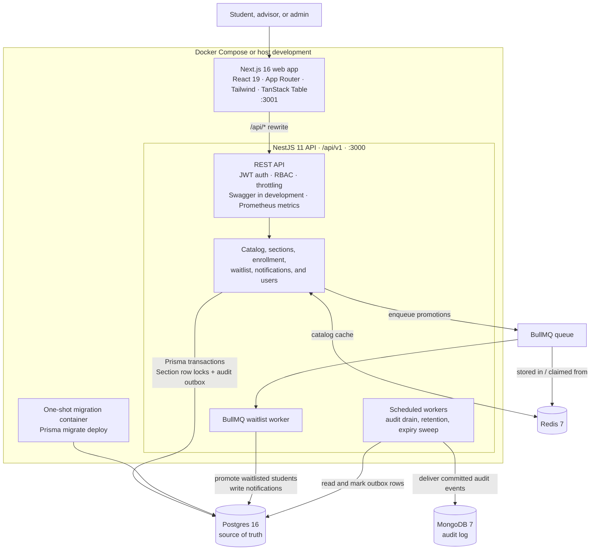
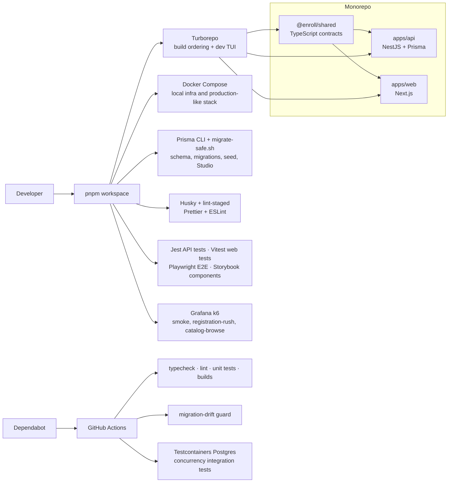

# Enroll

Course registration system designed to handle the concurrency and data integrity challenges of registration day. Built as a pnpm monorepo with a NestJS API and a Next.js web app.

## Architecture

### Runtime and data flow



Enrollment remains a Postgres transaction: a section-level row lock protects
capacity, and the same commit writes an audit-outbox row. Redis backs both the
catalog cache and BullMQ; background workers promote the waitlist and write
notifications. The scheduled outbox drainer sends only committed audit events to
MongoDB, so a Mongo outage cannot lose the audit record.

### Workspace, delivery, and quality tooling



The diagrams intentionally show every first-class runtime dependency and repository
tooling path. Individual libraries used inside those components are documented in
their workspace `package.json` files.

## Layout

```text
apps/
  api/          NestJS, Prisma, Postgres, Redis (BullMQ), Mongo (audit)
  web/          Next.js 16 (App Router, port 3001)
packages/
  shared/       TypeScript contracts both apps import as @enroll/shared
load/           k6 registration-day load profile
scripts/        migrate-safe.sh, the Prisma generated-column workaround
```

## Architecture decisions

- **Redis and BullMQ**: Offloads non-critical paths from the enrollment transaction. Waitlist promotion sweeps and audit log draining are enqueued to background workers, keeping the main request cycle fast and decoupled from downstream failures.
- **Postgres row locks**: Enrollment concurrency is serialized via `SELECT ... FOR UPDATE` at the section level. This avoids complex distributed locking and guarantees safe capacity checks without over-enrolling.
- **Mongo audit outbox**: Audit events are saved transactionally alongside the domain mutation in Postgres (the outbox pattern), then drained to Mongo asynchronously. This ensures audit trails are never lost if the external datastore is temporarily unavailable.
- **Generated search vector workaround**: `Course.searchVector` uses a Postgres generated column for full-text search. Prisma cannot model this natively, creating drift where `prisma migrate dev` attempts to drop it. `migrate-safe.sh` acts as a deployment safety net, scrubbing the diff before apply.
- **Concurrency testing**: A dedicated `k6` load profile (`load/registration-day.js`) simulates the thundering herd of a registration window opening. Assertions verify that capacity is perfectly respected under high contention and that lock wait times remain acceptable.

## UI & Presentation Architecture

- **Enterprise-Grade DataGrids**: Complex table views (Catalogs, Schedules, and Academic History) are powered by `@tanstack/react-table`. This achieves perfectly ergonomic column alignment, strict pixel-perfect widths, and seamless type-safe data bindings, far surpassing brittle flex-box wrappers.
- **Bespoke Product Layouts**: The application interface rejects generic "bento box" card patterns in favor of bespoke, staff-level design principles. Core pages utilize explicit 12-column CSS grids to strictly enforce main-content vs. sidebar proportions (e.g., 8:4 or 9:3 splits), ensuring robust data displays have breathing room across all viewports.
- **Polished Aesthetics & Typography**: The presentation tier leverages a cohesive, commanding design system with custom micro-interactions. Dynamic status badge theming, rich typography (`font-display`), bespoke gradient avatars, and sophisticated borders (`ring-pine/20`) construct an impeccable and trustworthy user experience.

## Prerequisites

- Node.js >= 20.11
- pnpm >= 9 (`corepack enable && corepack prepare pnpm@10.33.2 --activate`)
- OrbStack (`brew install orbstack`) or Docker Desktop, for the three
  infrastructure services and the integration tests

The API needs Postgres, Redis, and Mongo. Redis is not optional: the app validates
its environment at boot and refuses to start without `REDIS_URL`. Mongo is, and its
absence is reported rather than fatal, because audit rows buffer in the Postgres
outbox until it comes back.

The containers bind **5442, 6389, and 27027**, not the default 5432, 6379, and 27017. A Homebrew postgres or redis on the default port is common enough that
binding it would either fail outright or, worse, leave the API talking to some
other machine's database while everything looked fine. Override with
`POSTGRES_PORT`, `REDIS_PORT`, or `MONGO_PORT` if these collide too.

## First-time setup

```bash
./setup.sh        # or: pnpm setup
```

Checks for OrbStack and pnpm (starting the OrbStack engine if it is installed but
idle), installs dependencies, builds `@enroll/shared`, brings up the three
containers and waits for their health checks, writes `apps/api/.env`, applies
migrations, and seeds. It is idempotent, so re-run it whenever the stack drifts.
`--reset` wipes the volumes first; `--no-seed` skips the seed.

Seeded logins are 50 students, 5 advisors, and 2 admins, every one with the
password `password`. Emails are faker-generated, so list them rather than guess:

```bash
pnpm db:studio
```

## Environment profiles

`apps/api/.env` is a copy of a profile, not the source of truth. Two exist:

| Profile      | Postgres  | Redis     | Mongo     |
| ------------ | --------- | --------- | --------- |
| `.env.local` | container | container | container |
| `.env.cloud` | Neon      | Upstash   | Atlas     |

```bash
pnpm env:local    # point the API at the containers
pnpm env:cloud    # point it back at the hosted services
pnpm env:which    # show the active profile, secrets redacted
pnpm health       # round-trip every dependency and report what is down
```

Switching rewrites `.env`. If your `.env` matches neither profile, the switcher
saves it to `.env.bak` before overwriting rather than dropping the edits.

## Running

Two modes. Both want ports 3000 and 3001, so each one hands over from the other
rather than letting you discover the clash as a bare `EADDRINUSE` from Next that
never mentions the container actually holding the port.

`pnpm dev` stops the api and web containers and leaves the infrastructure up, so
the database survives the switch. `pnpm stack:up` refuses to start while a host
dev server holds a port. Either takes `--force` to kill whatever is in the way.

**Always on.** Everything, including the API and the web app, runs as a container
with `restart: unless-stopped`. OrbStack is set to start at login, so after a
reboot the whole stack is simply up with nothing to type.

```bash
pnpm stack:up        # build and start all five containers
pnpm stack:rebuild   # after a code change: rebuild api and web
pnpm stack:logs      # tail api and web
pnpm stack:down      # stop everything
```

**Hot reload.** Infrastructure stays in containers, the two apps run on the host
in watch mode.

```bash
pnpm dev             # stops the api and web containers, then watch mode
pnpm dev --force     # also kill host processes squatting on the ports
pnpm dev:api         # or one at a time, no handover
pnpm dev:web
```

`pnpm dev` runs through Turbo's TUI (`ui: "tui"` in `turbo.json`), arrow keys to
switch panes:

```
api#dev           nest start --watch
web#dev           next dev --turbopack -p 3001
//#dev:postgres   docker compose logs -f postgres
//#dev:redis      docker compose logs -f redis
//#dev:mongo      docker compose logs -f mongo
```

The three infrastructure panes **follow** their containers rather than running
them. Letting Turbo own `docker compose up` would tie the database's lifetime to
the dev session, so quitting the TUI would take Postgres down and undo the
always-on setup. They are root tasks (the `//#` prefix), which is what lets them
exist without inventing a workspace package per service.

Turbo degrades to prefixed line output on its own when there is no terminal, and
`scripts/dev.sh` takes the plain `pnpm --parallel` path when stdin or stdout is
not a TTY, so `pnpm dev | tee` and CI stay readable.

Turbo also makes `@enroll/shared` build before either app starts, via
`dependsOn: ["^build"]`. That removes the standing footgun where a fresh clone
fails with a missing-export error that reads like a code bug.

Migrations run as a one-shot `migrate` container that must exit 0 before the API
starts, rather than from the API's entrypoint where replicas would race each
other. `restart: no` keeps a reboot from replaying it; `pnpm stack:up` reruns it,
which is when new migrations land.

The containerised API runs with `NODE_ENV=production`, so Swagger at `/api/docs`
is off there. Use the host dev server when you want it.

The Next.js dev server rewrites `/api/*` to the API's versioned routes
(`/api/v1/*`) via `apps/web/next.config.ts`, so browser code keeps calling `/api`
and the version lives server-side.

## Verifying

```bash
pnpm verify   # typecheck, lint, test, build across both apps
```

Individually:

```bash
curl http://localhost:3000/api/health/ready
# {"status":"ok","checks":{"postgres":"up","redis":"up","mongo":"up"}}

curl http://localhost:3000/api/metrics   # Prometheus exposition
open http://localhost:3000/api/docs      # Swagger, non-production only
```

Then open http://localhost:3001. The home route redirects to the catalog, via
sign-in if you are logged out.

## Load testing (Grafana k6)

To simulate the thundering herd of a registration window opening and verify the locking architecture under high contention, the repository includes a Grafana k6 load profile.

Ensure you have [Grafana k6 installed](https://grafana.com/docs/k6/latest/set-up/install-k6/), the database is seeded (`pnpm --filter api prisma db seed`), and the stack is running. Then, execute the script by passing the targeted section IDs (e.g. from the seeded database):

```bash
BASE_URL=http://localhost:3000/api/v1 \
SECTION_IDS=sec-1,sec-2,sec-3 \
k6 run load/registration-day.js
```

This ramps up to 1,000 concurrent Virtual Users (VUs) attempting to claim seats. The script automatically verifies that `seat_overcommit` remains zero and measures the `p99` latency cost of pessimistic locking.

## Scripts

| Script                      | What it does                                             |
| --------------------------- | -------------------------------------------------------- |
| `./setup.sh`                | Clone to running stack, idempotent                       |
| `pnpm stack:up` / `:down`   | All five containers, always-on mode                      |
| `pnpm stack:rebuild`        | Rebuild the api and web images after a code change       |
| `pnpm dev`                  | Both apps in watch mode on the host                      |
| `pnpm dev:api`              | NestJS in watch mode                                     |
| `pnpm dev:web`              | Next.js dev server                                       |
| `pnpm health`               | Check every dependency, exit 1 if a required one is down |
| `pnpm infra:up` / `:down`   | Start or stop Postgres, Redis, and Mongo                 |
| `pnpm infra:reset`          | Drop the volumes and start clean                         |
| `pnpm infra:logs` / `:ps`   | Tail container logs, list container status               |
| `pnpm env:local` / `:cloud` | Swap the API between containers and hosted services      |
| `pnpm verify`               | Typecheck, lint, test, and build everything              |
| `pnpm test`                 | Unit and component tests for both apps                   |
| `pnpm test:integration`     | Concurrency invariants against a real Postgres (Docker)  |
| `pnpm db:migrate:safe`      | Generate and apply a migration, scrubbing FTS drift      |
| `pnpm db:studio`            | Prisma Studio                                            |
| `pnpm build:shared`         | Rebuild `@enroll/shared` after changing a contract       |

## Migrations

Use `pnpm db:migrate:safe <name>`, not `prisma migrate dev`.

`Course.searchVector` is a Postgres generated column, which Prisma cannot model, so
every migration that diffs `Course` picks up two spurious lines: a `DROP INDEX` that
silently removes the GIN index catalog search depends on, and a `DROP DEFAULT` that
fails at apply time. The script strips both, and CI fails any migration that
reintroduces them.

## Deployment notes

Two things do not survive a naive scale-out:

- **Schedulers.** The audit outbox drain, the hourly waitlist expiry, and the
  promotion safety-net sweep are timer-driven and not leader-elected. Run web
  replicas with `SCHEDULERS_ENABLED=false` and exactly one worker deployment with it
  on. BullMQ promotion workers run everywhere regardless; only timers are gated.
- **`TRUST_PROXY_HOPS`.** Set it to the number of proxies in front of the process.
  Left at 0, `req.ip` is the proxy's address, so the audit trail attributes every
  action to the load balancer and IP throttling treats all traffic as one client.

Migrations belong in a release step that runs once, not in a container entrypoint
where replicas would race each other.

## Registration rules

The enrollment transaction validates a fixed sequence of checks before granting or
waitlisting a seat. Each check is cheaper than the next, so the system rejects early
and avoids locking when it can.

1. **Section exists** and its term's registration window has not closed.
2. **Student exists** in the system.
3. **Standing-aware registration window.** If the term defines per-standing open
   dates (e.g., seniors register Monday, freshmen register Thursday), the student's
   class standing must have an open window. Falls back to the term's
   `registrationOpens` when no per-standing row exists.
4. **Advisor hold.** An `AdvisorHold` with a null `releasedAt` blocks all
   registration until an advisor releases it.
5. **Row lock.** `SELECT ... FOR UPDATE` on the Section row serializes concurrent
   seat allocation.
6. **Active-row check.** A student who is already ENROLLED or WAITLISTED in the
   same section gets the existing row returned (idempotent).
7. **Same-course duplicate.** A student cannot hold active enrollments in two
   different sections of the same course.
8. **Prerequisites.** Every `CoursePrerequisite` edge for the target course must
   map to a COMPLETED enrollment in the student's history.
9. **Time conflicts.** The target section's `meetingPattern` is compared against
   every section the student is active in for the same term. Patterns like
   `MWF 9:00-9:50` and `TR 1:30-2:45` are parsed into day+minute slots for
   overlap detection.
10. **Credit limit.** The student's active credits in the term plus the target
    course's credits cannot exceed `Term.maxCredits`, unless an
    `OverloadApproval` raises their personal cap.
11. **Capacity or waitlist.** If a seat is free, the student gets ENROLLED. If
    not, they join the waitlist (subject to the section's waitlist cap).

### Section swap

`PATCH /api/v1/enrollments/:id/swap` with `{ targetSectionId }` atomically drops
the source enrollment and enrolls in the target section within a single
transaction. Both sections are locked in ID order to prevent deadlocks.

The swap fails (keeping the source enrollment intact) if the target section is
full. Waitlisting on swap is not supported: a student who wants a waitlist spot
should drop and enroll separately.

All eligibility checks apply to the target section, with two adjustments:

- Time conflicts and credit limits exclude the source section, since it is being
  vacated.
- The same-course duplicate check is skipped when both sections belong to the
  same course.

When the source enrollment was ENROLLED, the old section's counter is decremented
and a waitlist promotion is enqueued, exactly as with a regular drop.

## Failure modes handled

The system is designed to fail predictably under load and edge-case conditions:

- **Over-enrollment:** Prevented by `SELECT ... FOR UPDATE` row locks on the Section table. High concurrency will queue at the database level rather than overselling seats.
- **Duplicate active enrollments:** Prevented by a unique composite index and transactional checks. A student cannot hold an active `ENROLLED` or `WAITLISTED` state in multiple sections of the same course.
- **Advisor hold:** Checked unconditionally at the start of the enrollment transaction. Blocks all add/drop activity until a staff member releases it.
- **Prereq failure:** Course prerequisite graphs are validated against the student's completed academic history. Missing prerequisites immediately abort the transaction.
- **Time conflict:** Checked via algorithmic overlap detection of meeting patterns against the student's active schedule for the term.
- **Queue/outbox downtime:** The transactional outbox pattern guarantees audit events are persisted in Postgres alongside the domain mutation. If the background Mongo drain or Redis waitlist sweep fails, messages remain in the outbox/queue to be retried automatically when infrastructure recovers.

## Data model

The Prisma schema (`apps/api/prisma/schema.prisma`) defines the full data model.
Additions beyond the base enrollment tables:

| Model                | Purpose                                                 |
| -------------------- | ------------------------------------------------------- |
| `CoursePrerequisite` | DAG of course dependencies (self-referential on Course) |
| `RegistrationWindow` | Per-standing open dates for a term                      |
| `AdvisorHold`        | Blocks registration until `releasedAt` is set           |
| `OverloadApproval`   | Per-student credit cap override for a specific term     |

`User.classStanding` is a nullable `ClassStanding` enum (FRESHMAN through SENIOR).
`Term.maxCredits` defaults to 18 and is the baseline credit cap.

## Future work

Two planned phases are not yet built.

**AI degree advisor.** An LLM-backed endpoint that reads a student's transcript
(completed enrollments), their program requirements, and the current catalog to
suggest a next-semester schedule. Would use structured output from the model to
produce a ranked list of section recommendations with reasoning. The main design
question is whether to run it synchronously (slow but simple) or queue it as a
background job and notify when ready.

**Grades, instructor role, and tuition.** Three related features that close the
registration lifecycle:

- A `grade` column on Enrollment, set by a new INSTRUCTOR role scoped to their
  own sections. The COMPLETED status transition would become grade-gated rather
  than manual.
- Tuition calculation: credit-hour rates, fee schedules, and a billing summary
  endpoint. Probably a separate `Billing` module rather than bolting it onto
  enrollment.
- An instructor dashboard for viewing rosters, entering grades, and managing
  section settings.

## What I'd improve in production

While this architecture handles registration load securely, a production rollout would need a few structural additions:

- **Read Replicas & CQRS:** The catalog and profile views currently query the primary Postgres database. In a real registration event, I'd split reads to a dedicated replica or serve catalog state entirely from a Redis cache to protect the mutation database.
- **Circuit Breakers:** External integrations (like an identity provider or billing API) would need circuit breakers to prevent cascading failures if they go down during peak traffic.
- **Distributed Tracing:** Implementing OpenTelemetry (OTel) to trace requests from the Next.js frontend, through the NestJS API, down to the BullMQ workers and Prisma queries. This is critical for diagnosing latency spikes under load.
- **Dead Letter Queues (DLQ):** While the outbox pattern ensures durability, I'd implement proper DLQ monitoring and alerting for audit events or waitlist promotions that exhaust their retry limits.

## Further reading

- `apps/api/prisma/schema.prisma` for the data model, constraints, and index rationale
- `apps/api/src/enrollment/enrollment.service.ts` for enroll, drop, and swap under row locks
- `apps/api/src/enrollment/time-conflict.ts` for meeting pattern parsing and overlap detection
- `apps/web/src/proxy.ts` for the session gate and single-flight token refresh
- `load/registration-day.js` for what to measure before a real registration day
- `bible/` for the chapter-by-chapter build record (local only, not in git)
