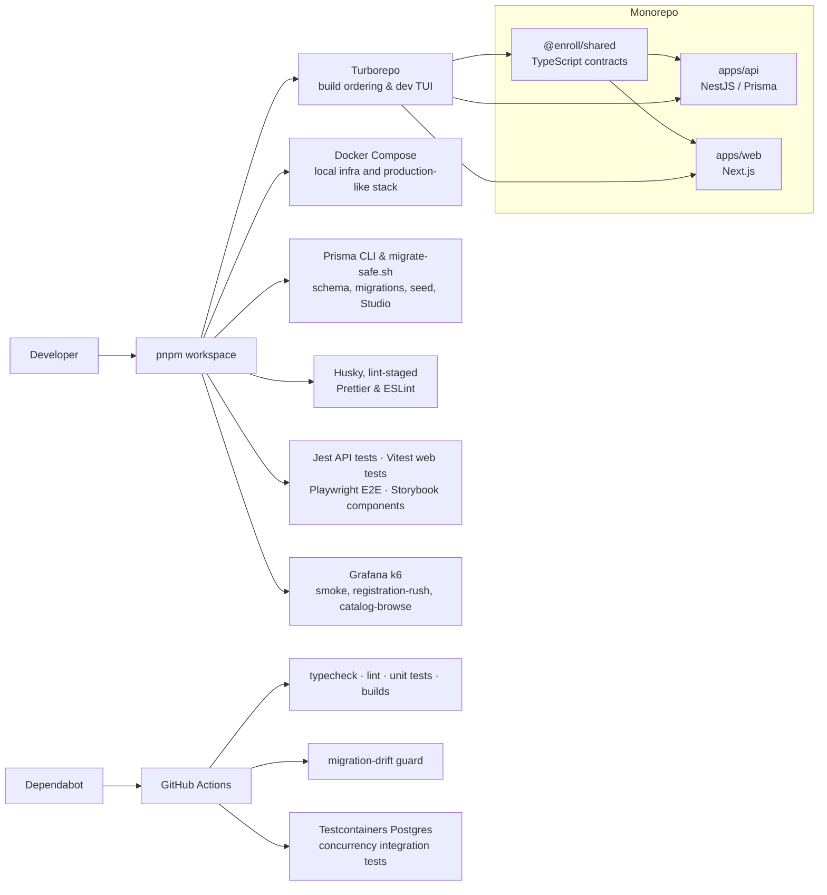

# Enroll

Course registration system built for registration-day concurrency and data integrity.
It is a pnpm monorepo with a NestJS API and a Next.js web app.

## Architecture

### Runtime and data flow


Enrollment remains a Postgres transaction: a section-level row lock protects
capacity, and the same commit writes an audit-outbox row. Redis backs both the
catalog cache and BullMQ; background workers promote the waitlist and write
notifications. The scheduled outbox drainer sends only committed audit events to
MongoDB, so a Mongo outage cannot lose the audit record.

### Workspace, delivery, and quality tooling



The diagrams intentionally show every first-class runtime dependency and repository
tooling path. Individual libraries used inside those components are documented in
their workspace `package.json` files.

## Layout

```text
apps/
  api/          NestJS, Prisma, Postgres, Redis (BullMQ), Mongo (audit)
  web/          Next.js 16 (App Router, port 3001)
packages/
  shared/       TypeScript contracts both apps import as @enroll/shared
load/           k6 registration-day load profile
scripts/        migrate-safe.sh, the Prisma generated-column workaround
```

## Architecture decisions

- **Redis and BullMQ:** Waitlist promotion runs in a background worker instead of
  the enrollment request.
- **Postgres row locks:** `SELECT ... FOR UPDATE` on a section serializes capacity
  checks and prevents over-enrollment.
- **Mongo audit outbox:** The transaction writes the domain change and an outbox
  record in Postgres. A worker later copies the record to MongoDB.
- **Generated search vector:** `Course.searchVector` is a Postgres generated
  column that Prisma cannot model. `migrate-safe.sh` removes the resulting invalid
  migration changes before deployment.
- **Concurrency tests:** `load/registration-day.js` uses k6 to test capacity and
  lock-wait behavior under contention.

## UI implementation

- **Tables:** Catalog, schedule, and academic-history tables use
  `@tanstack/react-table`.
- **Layout:** Main pages use 12-column CSS grids, including 8:4 and 9:3
  content/sidebar splits.
- **Components:** Shared UI components provide status badges, avatars, typography,
  and border styles.

## Prerequisites

- Node.js >= 20.11
- pnpm >= 9 (`corepack enable && corepack prepare pnpm@10.33.2 --activate`)
- OrbStack (`brew install orbstack`) or Docker Desktop, for the three
  infrastructure services and the integration tests

The API needs Postgres, Redis, and Mongo. Redis is not optional: the app validates
its environment at boot and refuses to start without `REDIS_URL`. Mongo is, and its
absence is reported rather than fatal, because audit rows buffer in the Postgres
outbox until it comes back.

The containers bind **5442, 6389, and 27027**, not the default 5432, 6379, and 27017. A Homebrew postgres or redis on the default port is common enough that
binding it would either fail outright or, worse, leave the API talking to some
other machine's database while everything looked fine. Override with
`POSTGRES_PORT`, `REDIS_PORT`, or `MONGO_PORT` if these collide too.

## First-time setup

```bash
./setup.sh        # or: pnpm setup
```

The script checks for OrbStack and pnpm, starts an installed but idle OrbStack
engine, installs dependencies, builds `@enroll/shared`, starts the three
infrastructure containers, waits for their health checks, writes `apps/api/.env`,
applies migrations, and seeds the database. It is idempotent; re-run it when the
stack drifts.

`--reset` wipes the volumes first; `--no-seed` skips the seed.

The seed creates 50 students, 5 advisors, and 2 admins. All use the password
`password`. Their email addresses are generated, so list them with:

```bash
pnpm db:studio
```

## Environment profiles

`apps/api/.env` is a copy of a profile, not the source of truth. Two exist:

| Profile      | Postgres  | Redis     | Mongo     |
| ------------ | --------- | --------- | --------- |
| `.env.local` | container | container | container |
| `.env.cloud` | Neon      | Upstash   | Atlas     |

```bash
pnpm env:local    # point the API at the containers
pnpm env:cloud    # point it back at the hosted services
pnpm env:which    # show the active profile, secrets redacted
pnpm health       # round-trip every dependency and report what is down
```

Switching rewrites `.env`. If your `.env` matches neither profile, the switcher
saves it to `.env.bak` before overwriting rather than dropping the edits.

## Running

There are two modes. Both use ports 3000 and 3001, so each mode stops the other
before it starts.

`pnpm dev` stops the API and web containers but leaves infrastructure running.
`pnpm stack:up` refuses to start while a host development server holds a port.
Either accepts `--force` to stop the conflicting process.

**Containers.** The API and web app run with `restart: unless-stopped`. With
OrbStack configured to start at login, the stack restarts after a reboot.

```bash
pnpm stack:up        # build and start all five containers
pnpm stack:rebuild   # after a code change: rebuild api and web
pnpm stack:logs      # tail api and web
pnpm stack:down      # stop everything
```

**Hot reload.** Infrastructure stays in containers, the two apps run on the host
in watch mode.

```bash
pnpm dev             # stops the API and web containers, then starts watch mode
pnpm dev --force     # also kill host processes squatting on the ports
pnpm dev:api         # or one at a time, no handover
pnpm dev:web
```

`pnpm dev` runs through Turbo's TUI (`ui: "tui"` in `turbo.json`). Use the arrow
keys to switch panes:

```
api#dev           nest start --watch
web#dev           next dev --turbopack -p 3001
//#dev:postgres   docker compose logs -f postgres
//#dev:redis      docker compose logs -f redis
//#dev:mongo      docker compose logs -f mongo
```

The three infrastructure panes tail container logs. Turbo does not run
`docker compose up`, so leaving the TUI does not stop Postgres. They are root
tasks (the `//#` prefix), so they do not need workspace packages.

Turbo degrades to prefixed line output on its own when there is no terminal, and
`scripts/dev.sh` takes the plain `pnpm --parallel` path when stdin or stdout is
not a TTY, so `pnpm dev | tee` and CI stay readable.

Turbo also makes `@enroll/shared` build before either app starts, via
`dependsOn: ["^build"]`. This prevents a fresh clone from failing on missing
shared-package exports.

Migrations run as a one-shot `migrate` container that must exit 0 before the API
starts, rather than from the API's entrypoint where replicas would race each
other. `restart: no` keeps a reboot from replaying it; `pnpm stack:up` reruns it,
which is when new migrations land.

The containerised API runs with `NODE_ENV=production`, so Swagger at `/api/docs`
is off there. Use the host dev server when you want it.

The Next.js dev server rewrites `/api/*` to the API's versioned routes
(`/api/v1/*`) via `apps/web/next.config.ts`, so browser code keeps calling `/api`
and the version lives server-side.

## Verifying

```bash
pnpm verify   # typecheck, lint, test, build across both apps
```

Individually:

```bash
curl http://localhost:3000/api/health/ready
# {"status":"ok","checks":{"postgres":"up","redis":"up","mongo":"up"}}

curl http://localhost:3000/api/metrics   # Prometheus exposition
open http://localhost:3000/api/docs      # Swagger, non-production only
```

Then open http://localhost:3001. The home route redirects to the catalog, via
sign-in if you are logged out.

## Load testing (Grafana k6)

The repository includes Grafana k6 profiles for registration-day contention and
catalog browsing.

Ensure you have [Grafana k6 installed](https://grafana.com/docs/k6/latest/set-up/install-k6/), the database is seeded (`pnpm --filter api prisma db seed`), and the stack is running. Then, execute the script by passing the targeted section IDs (e.g. from the seeded database):

```bash
BASE_URL=http://localhost:3000/api/v1 \
SECTION_IDS=sec-1,sec-2,sec-3 \
k6 run load/registration-day.js
```

This profile ramps to 1,000 virtual users attempting to claim seats. It verifies
that `seat_overcommit` remains zero and measures p99 lock-wait latency.

## Scripts

| Script                      | What it does                                             |
| --------------------------- | -------------------------------------------------------- |
| `./setup.sh`                | Set up a running stack; safe to re-run                   |
| `pnpm stack:up` / `:down`   | Start or stop the five-container stack                   |
| `pnpm stack:rebuild`        | Rebuild the api and web images after a code change       |
| `pnpm dev`                  | Both apps in watch mode on the host                      |
| `pnpm dev:api`              | NestJS in watch mode                                     |
| `pnpm dev:web`              | Next.js dev server                                       |
| `pnpm health`               | Check every dependency, exit 1 if a required one is down |
| `pnpm infra:up` / `:down`   | Start or stop Postgres, Redis, and Mongo                 |
| `pnpm infra:reset`          | Drop the volumes and start clean                         |
| `pnpm infra:logs` / `:ps`   | Tail container logs, list container status               |
| `pnpm env:local` / `:cloud` | Swap the API between containers and hosted services      |
| `pnpm verify`               | Typecheck, lint, test, and build all workspaces          |
| `pnpm test`                 | Unit and component tests for both apps                   |
| `pnpm test:integration`     | Concurrency invariants against a real Postgres (Docker)  |
| `pnpm db:migrate:safe`      | Generate and apply a migration, scrubbing FTS drift      |
| `pnpm db:studio`            | Prisma Studio                                            |
| `pnpm build:shared`         | Rebuild `@enroll/shared` after changing a contract       |

## Migrations

Use `pnpm db:migrate:safe <name>`, not `prisma migrate dev`.

`Course.searchVector` is a Postgres generated column, which Prisma cannot model, so
every migration that diffs `Course` picks up two spurious lines: a `DROP INDEX` that
silently removes the GIN index catalog search depends on, and a `DROP DEFAULT` that
fails at apply time. The script strips both, and CI fails any migration that
reintroduces them.

## Deployment notes

For multiple replicas:

- **Schedulers.** The audit outbox drain, the hourly waitlist expiry, and the
  promotion safety-net sweep are timer-driven and not leader-elected. Run web
  replicas with `SCHEDULERS_ENABLED=false` and exactly one worker deployment with it
  on. BullMQ promotion workers run everywhere regardless; only timers are gated.
- **`TRUST_PROXY_HOPS`.** Set it to the number of proxies in front of the process.
  Left at 0, `req.ip` is the proxy's address, so the audit trail attributes every
  action to the load balancer and IP throttling treats all traffic as one client.

Migrations belong in a release step that runs once, not in a container entrypoint
where replicas would race each other.

## Registration rules

The enrollment transaction validates a fixed sequence of checks before granting or
waitlisting a seat. Each check is cheaper than the next, so the system rejects early
and avoids locking when it can.

1. **Section exists** and its term's registration window has not closed.
2. **Student exists** in the system.
3. **Standing-aware registration window.** If the term defines per-standing open
   dates (e.g., seniors register Monday, freshmen register Thursday), the student's
   class standing must have an open window. Falls back to the term's
   `registrationOpens` when no per-standing row exists.
4. **Advisor hold.** An `AdvisorHold` with a null `releasedAt` blocks all
   registration until an advisor releases it.
5. **Row lock.** `SELECT ... FOR UPDATE` on the Section row serializes concurrent
   seat allocation.
6. **Active-row check.** A student who is already ENROLLED or WAITLISTED in the
   same section gets the existing row returned (idempotent).
7. **Same-course duplicate.** A student cannot hold active enrollments in two
   different sections of the same course.
8. **Prerequisites.** Every `CoursePrerequisite` edge for the target course must
   map to a COMPLETED enrollment in the student's history.
9. **Time conflicts.** The target section's `meetingPattern` is compared against
   every section the student is active in for the same term. Patterns like
   `MWF 9:00-9:50` and `TR 1:30-2:45` are parsed into day/minute slots for
   overlap detection.
10. **Credit limit.** The student's active credits in the term plus the target
    course's credits cannot exceed `Term.maxCredits`, unless an
    `OverloadApproval` raises their personal cap.
11. **Capacity or waitlist.** If a seat is free, the student gets ENROLLED. If
    not, they join the waitlist (subject to the section's waitlist cap).

### Section swap

`PATCH /api/v1/enrollments/:id/swap` with `{ targetSectionId }` atomically drops
the source enrollment and enrolls in the target section within a single
transaction. Both sections are locked in ID order to prevent deadlocks.

The swap fails (keeping the source enrollment intact) if the target section is
full. Waitlisting on swap is not supported: a student who wants a waitlist spot
should drop and enroll separately.

All eligibility checks apply to the target section, with two adjustments:

- Time conflicts and credit limits exclude the source section, since it is being
  vacated.
- The same-course duplicate check is skipped when both sections belong to the
  same course.

When the source enrollment was ENROLLED, the old section's counter is decremented
and a waitlist promotion is enqueued, exactly as with a regular drop.

## Failure handling

- **Over-enrollment:** Section row locks serialize capacity checks.
- **Duplicate active enrollments:** A composite index and transaction checks prevent
  a student from holding active enrollments in multiple sections of one course.
- **Advisor holds:** Enrollment checks for an unreleased hold before add or drop.
- **Prerequisites and time conflicts:** The transaction rejects invalid academic
  history and overlapping meeting patterns.
- **Queue or audit-store outages:** The outbox and queue retain pending work for
  retry when Redis or MongoDB recovers.

## Data model

The Prisma schema (`apps/api/prisma/schema.prisma`) defines the full data model.
Additions beyond the base enrollment tables:

| Model                | Purpose                                                 |
| -------------------- | ------------------------------------------------------- |
| `CoursePrerequisite` | DAG of course dependencies (self-referential on Course) |
| `RegistrationWindow` | Per-standing open dates for a term                      |
| `AdvisorHold`        | Blocks registration until `releasedAt` is set           |
| `OverloadApproval`   | Per-student credit cap override for a specific term     |

`User.classStanding` is a nullable `ClassStanding` enum (FRESHMAN through SENIOR).
`Term.maxCredits` defaults to 18 and is the baseline credit cap.

## Future work

Two planned phases are not yet built.

**Degree advisor.** An LLM-backed endpoint could read a student's completed
enrollments, program requirements, and the current catalog to suggest a
next-semester schedule. It would return structured section recommendations. The
open design question is whether it should run synchronously or as a background job.

**Grades, instructor role, and tuition.** Three related features that close the
registration lifecycle:

- A `grade` column on Enrollment, set by a new INSTRUCTOR role scoped to their
  own sections. The COMPLETED status transition would require a grade.
- Tuition calculation: credit-hour rates, fee schedules, and a billing summary
  endpoint, likely in a separate `Billing` module.
- An instructor dashboard for viewing rosters, entering grades, and managing
  section settings.

## Production follow-ups

- **Read replicas or a read model:** Catalog and profile reads currently use the
  primary Postgres database. A replica or Redis-backed catalog read model would
  protect the mutation path during registration peaks.
- **Circuit breakers:** External services such as an identity provider or billing
  API need isolation from cascading failures.
- **Distributed tracing:** OpenTelemetry could trace requests across the web app,
  API, BullMQ workers, and Prisma queries.
- **Dead-letter queues:** Monitor and alert on audit or waitlist jobs that exhaust
  retries.

## Further reading

- `apps/api/prisma/schema.prisma` for the data model, constraints, and index rationale
- `apps/api/src/enrollment/enrollment.service.ts` for enroll, drop, and swap under row locks
- `apps/api/src/enrollment/time-conflict.ts` for meeting pattern parsing and overlap detection
- `apps/web/src/proxy.ts` for the session gate and single-flight token refresh
- `load/registration-day.js` for what to measure before a real registration day
- `bible/` for the chapter-by-chapter build record (local only, not in git)
